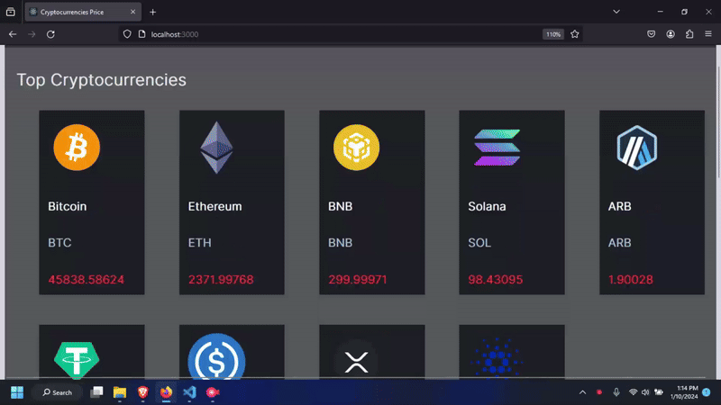
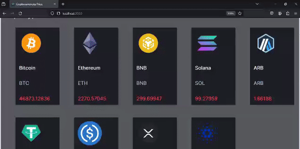

## Cryptocurrency API Documentation 



## The Cryptocurrency Price Tracking API provides real-time information about cryptocurrency prices and allows users to manage user's favorite cryptocurrencies. This provides an overview of available endpoints, authentication procedures, and real-time updates through WebSocket. 

### Base URL:
 ```console
 http://localhost:5001
 ```

## WebSocket
### Real-time cryptocurrency updates are available through WebSocket.
### WebSocket Connection
 ```jsx harmony
  const socket = new WebSocket('ws://localhost:5001');
```
### Real-Time Updates

 ```jsx harmony
 socket.onmessage = (event) => {
  const data = JSON.parse(event.data);
  console.log(data);
};
```
## Web Socket Middleware websocketMiddleware
``` jsx harmony
//Import the 'ws' library and a custom function called 'fetchRealTimeCryptoDetails'.

const WebSocket = require('ws');
const fetchRealTimeCryptoDetails = require('../util/FetchRealTimeCryptoDetails');

//Define the main middleware function called 'websocketMiddleware' that takes a 'server' as a parameter.
function websocketMiddleware(server) {
  const wss = new WebSocket.Server({ noServer: true });

//Set up an event listener for the 'connection' event on the WebSocket server. When a client connects, it triggers the 'connection' event.
  wss.on('connection', (ws) => {

//fetchRealTimeCryptoDetails(wss);
    fetchRealTimeCryptoDetails(wss);

//console.log('WebSocket connection established.');
    console.log('WebSocket connection established.');

//Set up an event listener for 'close' event on the WebSocket. When a client disconnects, it triggers the 'close' event, and a message is logged.
    ws.on('close', () => {
      console.log('WebSocket connection closed.');
    });
  });

//Use the 'handleUpgrade' method of the WebSocket server to handle the upgrade request. This method upgrades the connection to a WebSocket connection.
  server.on('upgrade', (request, socket, head) => {
    wss.handleUpgrade(request, socket, head, (ws) => {
      wss.emit('connection', ws, request);
    });
  });

//Return a middleware function that adds the WebSocket clients to the 'req.app.locals.wsConnections' property and calls the 'next' function to continue with the next middleware.
  return (req, res, next) => {
    req.app.locals.wsConnections = wss.clients;
    next();
  };
}

//Export 'websocketMiddleware'  that can be used in other parts of the application.
module.exports = websocketMiddleware;

```

## Authentication
## JWT (JSON Web Token)
## To access protected endpoints, users need to authenticate using JWT.
### JWT Middlewares
``` jsx harmny
//Import necessary modules and the User model.
const User = require("../Models/UserModel");
require("dotenv").config();
const jwt = require("jsonwebtoken");

module.exports.userVerification = (req, res) => {

  //Extract the JWT from the cookies in the reques & Check if the token exists.
  const token = req.cookies.token
  if (!token) {
    return res.json({ status: false })
  }
  //Verify the JWT using the jwt.verify function, using the provided secret key from the environment variables (process.env.TOKEN_KEY)
  jwt.verify(token, process.env.TOKEN_KEY, async (err, data) => {
    if (err) {
     return res.json({ status: false })
    } else {
     //If the JWT is successfully verified, query the database (using Mongoose) to find the user with the specified id from the decoded token.
      const user = await User.findById(data.id)
      if (user) return res.json({ status: true, user: user.username })
      else return res.json({ status: false })
    }
  })
}
```
### Register User
 ```jsx harmony
http://localhost:5001/signup
 ```
### Request:
```console
{
  "username": "Mahesh Abeykoon",
  "email": "mahesh@test.com"
  "password": "something404"
}
 ```

### Response:
```console
{
 {
    "message": "User signed in successfully",
    "success": true,
    "user": {
        "email": "mahesh@test.com",
        "username": "Mahesh Abeykoon",
        "password": "$2b$15$9WifaIubKW7v2CflS.L1POqtIOnFeSD3pgThmYbO/ylHyTUybXvtC",
        "createdAt": "2024-01-09T18:35:05.099Z",
        "_id": "659d9d8f922d8d5d24de14c1",
        "__v": 0
    }
}
}
```

### Login
 ```jsx harmony
http://localhost:5001/login
```
### Request:

```console
{
  "username": "Mahesh Abeykoon",
  "password": "secure_password"
}
```
### Response
```console
{
    "message": "User logged in successfully",
    "success": true
}
```
## Cryptocurrencies

### Get Predifined Cryptocurrencies from the API

 ```jsx harmony
http://localhost:5001/predefined-cryptos
```
### Response
```console
[
    {
        "name": "BTC",
        "symbol": "BTC",
        "image": "https://www.cryptocompare.com/media/37746251/btc.png",
        "current_price": 45801.9231905197,
        "market_cap": 897463173247.0164
    },
    {
        "name": "ETH",
        "symbol": "ETH",
        "image": "https://www.cryptocompare.com/media/37746238/eth.png",
        "current_price": 2374.87531154135,
        "market_cap": 285422431610.18134
    },
    {
        "name": "USDT",
        "symbol": "USDT",
        "image": "https://www.cryptocompare.com/media/37746338/usdt.png",
        "current_price": 1.00038137923595,
        "market_cap": 97585943100.4162
    },
    {
        "name": "XRP",
        "symbol": "XRP",
        "image": "https://www.cryptocompare.com/media/38553096/xrp.png",
        "current_price": 0.564366238005054,
        "market_cap": 56429888452.34231
    },
    {
        "name": "SOL",
        "symbol": "SOL",
        "image": "https://www.cryptocompare.com/media/37747734/sol.png",
        "current_price": 98.081196675612,
        "market_cap": 55584757438.93808
    },
    {
        "name": "BNB",
        "symbol": "BNB",
        "image": "https://www.cryptocompare.com/media/40485170/bnb.png",
        "current_price": 300.199998980745,
        "market_cap": 47398226912.47582
    },
    {
        "name": "USDC",
        "symbol": "USDC",
        "image": "https://www.cryptocompare.com/media/34835941/usdc.png",
        "current_price": 1.00019289011243,
        "market_cap": 25221660157.165142
    },
    {
        "name": "ADA",
        "symbol": "ADA",
        "image": "https://www.cryptocompare.com/media/37746235/ada.png",
        "current_price": 0.507599057165022,
        "market_cap": 22841957572.425987
    },
    {
        "name": "STETH",
        "symbol": "STETH",
        "image": "https://www.cryptocompare.com/media/37621928/steth.png",
        "current_price": 2372.535658820616,
        "market_cap": 22130623419.419212
    },
    {
        "name": "ARB",
        "symbol": "ARB",
        "image": "https://www.cryptocompare.com/media/44081950/arb.png",
        "current_price": 1.91494878817787,
        "market_cap": 19149487879.86375
    }
]

```
### User makes POST requests on favourites Cryptocurrencies

```jsx harmony
http://localhost:5001/crypto
```
 ```jsx console
[
  {
    "name": "Bitcoin",
    "symbol": "BTC",
    "price": 45051.18
  },
  {
    "name": "Ethereum",
    "symbol": "ETH",
    "price": 2270.76
  },
  //..
]
```

### Get all Cryptocurrencies
#### Request:
 ```jsx harmony
http://localhost:5001/all-cryptos
```

### Response:
```console
[
    {
        "_id": "659ba9170a3157d377305ec9",
        "name": "XRP",
        "symbol": "XRP",
        "price": 23.271,
        "__v": 0
    },
    {
        "_id": "659d7e7a07b952ab6d52b002",
        "name": "Bitcoin",
        "symbol": "BTC",
        "price": 235.42,
        "__v": 0
    },
    {
        "_id": "659da173922d8d5d24de14db",
        "name": "Bitcoin",
        "symbol": "BTC",
        "price": 41.2,
        "__v": 0
    },
    {
        "_id": "659da46c922d8d5d24de14e5",
        "name": "Bitcoin",
        "symbol": "BTC",
        "price": 125.21,
        "__v": 0
    },
    {
        "_id": "659da49f922d8d5d24de14fb",
        "name": "Bitcoin",
        "symbol": "BTC",
        "price": 42.45,
        "__v": 0
    }
]
```
### Make a GET Request for Specified Id

```jsx harmony
http://localhost:5001/crypto/:id
```
### Make a PUT Request for Specified Id
 ```jsx harmony
http://localhost:5001/crypto/:id
```
### Make a DELETE Request for Specified Id
 ```jsx harmony
http://localhost:5001/crypto/:id
```
### Response
```console
Cryptocurrency deleted successfully
```



## Showing toast messages after every processes including user Signup, Signin, Add, Update ..Crytpo details


## Real-time data updaing in the home page


## CRUD operations for users favourites crypto details


